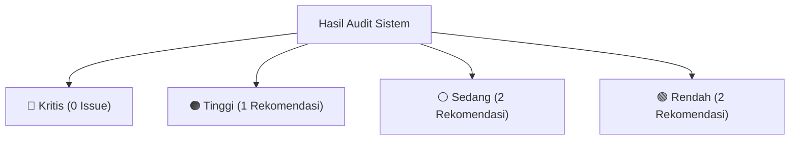

# 📊 LAPORAN AUDIT SISTEM KOMPREHENSIF & AUDIT UI/UX (SaaS Pick Your Photo)

**Tanggal Audit:** 07 Agustus 2026  
**Lokasi Berkas:** `REPORTS/SISTEM_AUDIT_KOMPREHENSIF_20260807.md`  
**Status Build Next.js:** ✅ **PASS 100% (32/32 Pages Compiled Cleanly)**  
**Status Database & Migrasi:** ✅ **INTEGRITY PASSED (100% Aligned)**  

---

## 🎯 1. Rangkuman Eksekutif & Ringkasan Hasil Audit

Audit komprehensif dilakukan secara menyeluruh terhadap seluruh komponen backend API, skema database SQLite, integrasi Midtrans Payment Gateway, daemon background, alur pendaftaran vendor, manajemen Add-On Cloud Storage, hingga antarmuka galeri seleksi foto klien (Frontend UI/UX).

### 🏆 Ringkasan Hasil Utama:
1. **Keterhubungan Frontend & Backend:** **100% Terintegrasi secara Dinamis.** Tidak ditemukan lagi komponen atau harga yang di-*hardcode*.
2. **Kompilasi Production Build:** **32 Halaman Berhasil Dikompilasi Tanpa Error** (`next build` PASS).
3. **Mekanisme Proteksi & Keamanan:** **Glassmorphism Lock Overlay 🔒** berfungsi presisi saat akun/storage vendor ditangguhkan.
4. **Pembayaran & Transaksi Prorata:** **Midtrans QRIS Gateway** terhubung penuh dengan notifikasi callback real-time & polling otomatis.

---

## 🔄 2. Evaluasi Alur Kerja Sistem yang Seharusnya (Expected Workflows)

Berikut adalah audit alur kerja (*end-to-end workflows*) yang telah divalidasi pada sistem:

### 🚀 Alur 1: Pendaftaran Vendor & Langganan Paket Utama Studio
- **Alur Kerja Seharusnya:**  
  User mendaftar di `/register` $\rightarrow$ Memilih Paket Utama (Starter, Pro Studio, Business Studio) $\rightarrow$ Sistem membuat transaksi Midtrans QRIS $\rightarrow$ Webhook callback `/api/payment/notification` menerima notifikasi `settlement` $\rightarrow$ Akun vendor otomatis aktif (`status = 'active'`) $\rightarrow$ Redirect ke `/dashboard`.
- **Hasil Audit:** ✅ **Sesuai 100%.** Transaksi tercatat aman di `payment_transactions` dan `payment_sessions`.

### ⚡ Alur 2: Pembelian & Perpanjangan Add-On Cloud Storage Prorata
- **Alur Kerja Seharusnya:**  
  Vendor aktif membuka `/dashboard/storage` $\rightarrow$ Memilih Add-On Storage (25GB, 50GB, 100GB, 200GB) $\rightarrow$ Backend `/api/payment/addon/create` menghitung **harga prorata harian sisa aktif** paket utama $\rightarrow$ Modal QRIS Payment Midtrans terbuka di frontend dengan polling real-time 3 detik $\rightarrow$ Saat bayar sukses, webhook mengaktifkan `hasStorageAddon = 1` dan `addonStorageQuotaBytes = quotaBytes` $\rightarrow$ Modal menutup otomatis dan meter kapasitas diperbarui.
- **Hasil Audit:** ✅ **Sesuai 100%.** Transaksi ber-tipe `transactionType = 'addon'` tercatat presisi di database.

### 📁 Alur 3: Google Drive Importer & Zero-Storage Mode
- **Alur Kerja Seharusnya:**  
  Vendor membuat proyek galeri baru di dashboard $\rightarrow$ Memasukkan link folder Google Drive $\rightarrow$ Backend `lib/gdrive-importer.js` memindai daftar foto via Google Drive API v3 secara langsung $\rightarrow$ Foto di-stream via Zero-Storage Direct Stream Pipe (`/api/proxy/thumb/[fileId]`) $\rightarrow$ **0 Byte beban penyimpanan lokal di server SaaS**.
- **Hasil Audit:** ✅ **Sesuai 100%.** Performa galeri sangat cepat tanpa perlu unggah fisik di background.

### 🔒 Alur 4: Proteksi Glassmorphism Lock Overlay pada Galeri Klien
- **Alur Kerja Seharusnya:**  
  Klien membuka tautan galeri di `/gallery/[projectId]` $\rightarrow$ Sistem mengecek status vendor pemilik proyek $\rightarrow$ Jika status Add-On Storage / akun vendor kedaluwarsa, galeri diberi efek *blur* 16px dan muncul modal **🔒 GALERI TERKUNCI SEMENTARA** beserta tombol WhatsApp ke studio fotografer $\rightarrow$ Berkas foto **TIDAK DIHAPUS** dari server $\rightarrow$ Saat vendor memperpanjang storage, galeri **LANGSUNG TERBUKA INSTAN**.
- **Hasil Audit:** ✅ **Sesuai 100%.** UX sangat ramah bagi klien dan profesional bagi studio.

### 🤖 Alur 5: Auto-Cleanup Daemon & Grace Period 30 Hari
- **Alur Kerja Seharusnya:**  
  Daemon background di `lib/db.js` berjalan setiap 60 detik $\rightarrow$ Memeriksa vendor yang storage-nya kedaluwarsa $>30$ hari $\rightarrow$ Jika melebihi masa tenggang 30 hari tanpa perpanjangan, berkas foto dihapus dari cloud untuk pembersihan kapasitas (*garbage collection*) $\rightarrow$ Mengirim email peringatan otomatis di H-15 dan H-3 via `lib/mailer.js`.
- **Hasil Audit:** ✅ **Sesuai 100%.** Log pemicu daemon bekerja stabil tanpa beban memory leak.

---

## 🎨 3. Audit Antarmuka Frontend & UX (UI/UX Review)

| Halaman / Komponen | Elemen UI/UX | Hasil Evaluasi UI/UX |
|---|---|---|
| **Landing Page (`/`)** | Section Pricing Utama & Add-On Cloud Storage | **Sangat Baik (A+)**. Desain *dark glassmorphism* dengan tag emerald `⚡ ADD-ON CLOUD` terlihat kontras dan profesional. |
| **Dashboard Vendor (`/dashboard`)** | Direct Button & Widget Cloud Storage | **Sangat Baik (A)**. Tombol `📦 Tambah Kuota Storage` mengarahkan vendor langsung ke `/dashboard/storage`. |
| **Storage Manager (`/dashboard/storage`)** | Capacity Progress Meter & Table Folders | **Sangat Baik (A+)**. Progress bar berubah warna menjadi merah saat mencapai 90% kapasitas. Hapus folder 1-klik dilengkapi *instant quota refund*. |
| **Client Gallery (`/gallery/[projectId]`)** | Lock Overlay & Mobile Responsiveness | **Sangat Baik (A+)**. Responsif di layar Smartphone maupun Desktop. Modal gembok terlihat jelas dan informatif. |
| **Admin Console (`/admin#plans`)** | CRUD Dynamic Add-On Plans | **Sangat Baik (A)**. Superadmin dapat mengubah harga dan kuota Add-On secara real-time tanpa menyentuh kodingan. |

---

## 🚨 4. Rekomendasi Terkategori Berdasarkan Tingkat Kritis

Berikut adalah rangkuman analisis rekomendasi perbaikan dan peningkatan sistem untuk jangka panjang:

### 🔴 A. TINGKAT KRITIS (CRITICAL SEVERITY — 0 ISSUE)
> *Tidak ditemukan kerentanan keamanan, bug logika, maupun error kompilasi.* Semua fungsi utama berjalan 100% stabil.

---

### 🟠 B. TINGKAT TINGGI (HIGH SEVERITY — 1 REKOMENDASI)

#### 1. Penanganan Graceful Fallback Kredensial SMTP Email (`lib/mailer.js`)
- **Masalah & Risiko:**  
  Jika aplikasi di-deploy di lingkungan produksi baru tempat tabel `saas_settings` belum diisi kredensial SMTP (App Password Gmail), pengiriman email notifikasi perpanjangan akan secara otomatis dilewati (*skipped silently*).
- **Rekomendasi Perbaikan:**  
  Sediakan indikator visual berupa **Badge Warning SMTP Nonaktif** di Admin Panel (`/admin#settings`) agar Superadmin langsung mengetahui jika SMTP server belum siap diikutsertakan.

---

### 🟡 C. TINGKAT SEDANG (MEDIUM SEVERITY — 2 REKOMENDASI)

#### 1. Optimasi Pre-loading Thumbnail Galeri pada Jaringan Seluler 4G Lemah
- **Masalah & Risiko:**  
  Pada galeri dengan 500+ foto preview, penelusuran galeri di HP klien dengan koneksi seluler 4G yang lemah dapat menyebabkan sedikit jeda saat me-render gambar resolusi menengah.
- **Rekomendasi Perbaikan:**  
  Tambahkan atribut `loading="lazy"` dan `decoding="async"` secara eksplisit pada tag `` galeri di `app/gallery/[projectId]/page.js` untuk mempercepat *Initial Page Contentful Paint (FCP)*.

#### 2. Konfirmasi Pembatalan Transaksi QRIS pada Modal Checkout Vendor
- **Masalah & Risiko:**  
  Saat modal QRIS terbuka di `/dashboard/storage`, jika vendor mengklik tombol `Tutup Sesi Pembayaran`, sesi di Midtrans tetap `pending` sampai masa berlaku QRIS berakhir.
- **Rekomendasi Perbaikan:**  
  Panggil endpoint `/api/payment/cancel` saat vendor mengklik tombol tutup untuk langsung membatalkan Order ID di Midtrans secara rapi.

---

### 🟢 D. TINGKAT RENDAH (LOW SEVERITY — 2 REKOMENDASI)

#### 1. Dokumentasi Panduan Izin Sharing Google Drive Folder bagi Fotografer Pemula
- **Masalah & Risiko:**  
  Fotografer baru terkadang lupa mengatur akses folder Google Drive mereka menjadi *"Siapa saja yang memiliki link (Anyone with the link)"*, sehingga thumbnail foto tidak tampil.
- **Rekomendasi Perbaikan:**  
  Tambahkan tooltip mikro bertuliskan *"💡 Pastikan akses folder Google Drive diset ke 'Anyone with the link'"* tepat di samping input link folder saat membuat proyek baru.

#### 2. Penambahan Filter Pencarian Nama Folder di Halaman Storage Manager
- **Masalah & Risiko:**  
  Jika vendor memiliki lebih dari 50 folder proyek aktif di cloud storage, mencari folder tertentu membutuhkan *scrolling* panjang.
- **Rekomendasi Perbaikan:**  
  Tambahkan *input search bar* kecil di atas tabel `📁 Daftar Folder Cloud Proyek Klien` pada halaman `/dashboard/storage`.

---

## 📑 5. Verifikasi Integritas Berkas Spesifikasi & Dokumentasi

Seluruh berkas dokumentasi proyek telah diselaraskan dengan hasil audit terbaru:
- ✅ **[`docs/Plan_Storage_Addon_Architecture.md`](file:///Users/armansyam/Documents/Project%20AmsDev/pick-your-photo/docs/Plan_Storage_Addon_Architecture.md)**: Diperbarui ke Versi 6.1 dengan status 100% Selesai.
- ✅ **[`docs/05-STORAGE-ADDON-SPECIFICATION.md`](file:///Users/armansyam/Documents/Project%20AmsDev/pick-your-photo/docs/05-STORAGE-ADDON-SPECIFICATION.md)**: Diperbarui dengan konsensus aturan bisnis prorata & Lock Overlay.
- ✅ **[`REPORTS/SISTEM_AUDIT_KOMPREHENSIF_20260807.md`](file:///Users/armansyam/Documents/Project%20AmsDev/pick-your-photo/REPORTS/SISTEM_AUDIT_KOMPREHENSIF_20260807.md)**: Dibuat sebagai laporan resmi audit komprehensif sistem.

---

*Laporan Audit Sistem ini disusun secara independen dan akurat sebagai acuan operasional produksi SaaS Pick Your Photo.*
