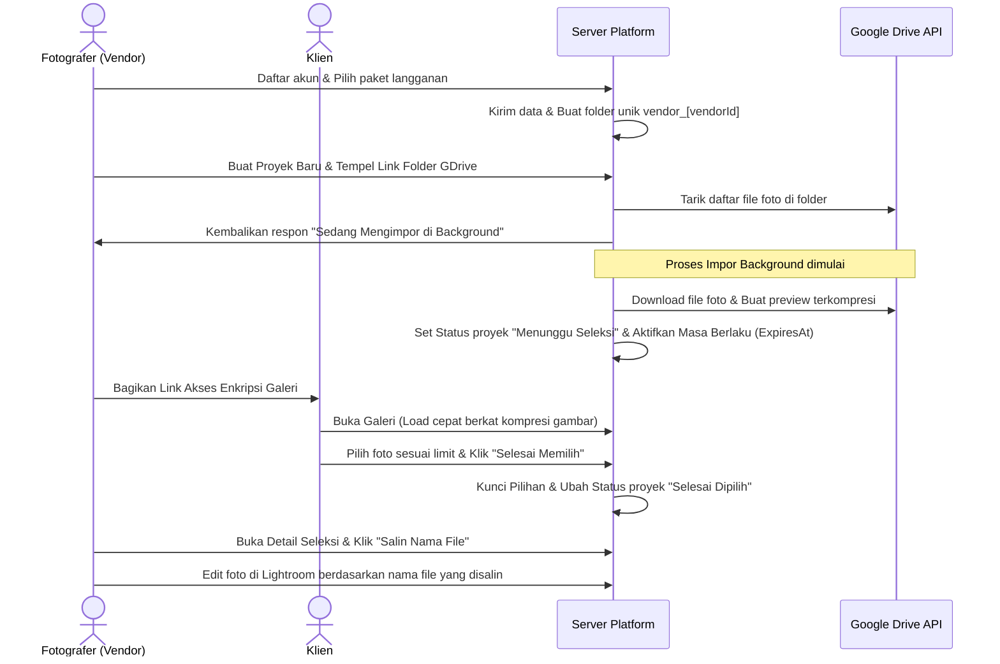

# Pick Your Photo — SaaS Platform Specification & Branding Guide

Dokumen ini menjelaskan spesifikasi produk, fitur, alur kerja, dan visi-misi dari platform **Pick Your Photo** sebagai bahan referensi (prompt) bagi AI pembuat Landing Page / Homepage Branding Anda.

---

## 🎯 Visi & Misi

### Visi
Menjadi platform SaaS (Software as a Service) nomor satu bagi fotografer profesional untuk berkolaborasi dengan klien dalam memilih foto terbaik secara instan, aman, dan elegan, sekaligus meningkatkan nilai profesionalisme brand mereka di mata klien.

### Misi
1. **Menghilangkan Kerumitan Manual:** Mengeliminasi proses manual pemilihan foto melalui chat WhatsApp atau spreadsheet yang melelahkan dan memakan waktu berjam-jam.
2. **Kecepatan & Efisiensi Tinggi:** Menyediakan fitur impor kilat langsung dari Google Drive ke server lokal dengan kompresi otomatis untuk load galeri yang sangat cepat.
3. **Keamanan & Privasi:** Memberikan keamanan galeri klien dengan proteksi kunci akses unik (*Access Key*) sehingga privasi foto klien tetap terjaga.
4. **Skalabilitas Bisnis Fotografer:** Membantu fotografer mengelola banyak proyek foto secara rapi dengan otomatisasi masa berlaku galeri (expired auto-delete).

---

## 👥 Segmentasi Pengguna (Target Audiens)
1. **Wedding & Event Photographer:** Fotografer pernikahan/acara yang menghasilkan ribuan foto sekali jepret dan butuh klien memilih beberapa puluh foto terbaik untuk diedit/dicetak.
2. **Studio & Portrait Photographer:** Fotografer studio/keluarga/wisuda yang butuh seleksi foto cepat untuk proses cetak album.
3. **Product & Commercial Photographer:** Fotografer produk yang bekerja sama dengan brand/klien korporasi untuk memilih aset foto yang disetujui.

---

## ⚡ Fitur Utama Platform (Core Features)

### 1. Sistem Keanggotaan Fotografer (SaaS Multi-Tier Subscription)
* **Paket Langganan Dinamis (2 Tipe):** Superadmin dapat membuat paket dengan 2 tipe utama:
  * **Tipe Limit-Based:** Dibatasi oleh jumlah proyek aktif maksimal dan jumlah foto maksimal per proyek.
  * **Tipe Storage-Based:** Tanpa batasan jumlah proyek atau foto, tetapi dibatasi oleh kuota kapasitas disk (dalam MB/GB).
* **Satu Kali Uji Coba (One-Time Free Trial):** Sistem mengunci fitur Free Trial agar hanya dapat digunakan sekali saat mendaftar, mencegah eksploitasi berulang.
* **Proses Registrasi Premium & Instan:**
  * **Registrasi Berbayar:** Menampilkan tujuan rekening bank admin dan form upload bukti transfer dengan transisi animasi yang mewah.
  * **Registrasi Free Trial:** Secara otomatis menyembunyikan form transfer bank dan kolom upload bukti bayar melalui animasi geser (*slide & fade*).
* **Integrasi WhatsApp Redirect:** Setelah mendaftar, calon vendor diarahkan ke WhatsApp Admin dengan pesan template otomatis yang disesuaikan dengan jenis paket yang dipilih (permintaan aktivasi gratis atau konfirmasi bukti bayar).

### 2. Google Drive Importer & Image Optimizer (Kilat di Background)
* **Impor Link Google Drive:** Fotografer cukup menempelkan link folder Google Drive publik berisi foto-foto klien.
* **Background Worker Processing:** Sistem membaca dan mengunduh seluruh file foto di latar belakang. Fotografer tidak perlu menunggu di halaman dan bisa langsung menutup modal/tab browser.
* **Image Compression & Optimization:** Foto diubah ukurannya secara otomatis (lebar maksimal 1200px untuk preview, 400px untuk thumbnail thumbnail) dengan kualitas JPEG optimal (70%) agar klien dapat membuka galeri dengan sangat cepat dan hemat kuota data.
* **🔄 Coba Impor Lagi (One-Click Retry):** Jika terjadi kegagalan jaringan atau Google Drive rate-limit, fotografer cukup menekan satu tombol kuning **"Coba Impor Lagi"** untuk mengulangi proses impor secara otomatis.

### 3. Galeri Klien Interaktif & Aman (Client Selection Portal)
* **Akses Tanpa Login:** Klien dapat membuka tautan galeri secara instan tanpa perlu mendaftar akun, cukup menggunakan kunci enkripsi unik di URL.
* **Batas Maksimal Pilihan (Max Selection Limit):** Fotografer dapat menentukan batas maksimal foto yang boleh dipilih oleh klien (misal: pilih maksimal 50 dari 200 foto).
* **Tampilan Grid & Lightbox Modern:** Antarmuka responsif di HP maupun komputer dengan background gelap (*dark mode*) mewah bergaya glassmorphism.
* **Pencegahan Penyalahgunaan:** Foto yang tampil di galeri klien dilindungi agar tidak mudah diunduh secara ilegal (menggunakan preview kompresi tinggi).
* **Fitur Satu Klik Salin Nama File:** Setelah klien menyelesaikan seleksi, fotografer dapat menyalin daftar nama file foto yang dipilih dalam format kompilasi teks dengan satu klik untuk langsung dimasukkan ke Adobe Lightroom / folder lokal komputer untuk proses editing lanjutan.

### 4. Manajemen Penyimpanan Otomatis (Auto Storage Cleaner)
* **Pembersihan Berbasis Status Akun Vendor (Grace Period 5 Hari):** Proyek tidak kedaluwarsa secara individual. Data foto proyek vendor akan dihapus otomatis dari server jika akun keanggotaan/berlangganan vendor tersebut kedaluwarsa lebih dari 5 hari.
* **Sistem Penyapu Disk (Cron Sweeper):** Background sweeper secara berkala memindai vendor yang kedaluwarsa lebih dari 5 hari, menghapus berkas foto fisik seluruh proyek mereka dari server untuk menghemat disk space, serta mereset total penyimpanan terpakai menjadi 0.
* **Sistem Rollback Penyimpanan Penuh:** Jika total penyimpanan vendor Paket Storage penuh di tengah proses impor Google Drive, sistem memicu rollback otomatis dengan menghapus file parsial dan mengembalikan kuota penyimpanan agar server stabil.

### 5. Struktur Folder Premium (Gold Standard SaaS Structure)
* Struktur file diatur rapi di server untuk mencegah tumpang tindih data antar vendor:
  `public/staging_uploads/vendor_[vendorId]/project_[projectId]_[projectSlug]/`
* Memudahkan pengelolaan file cadangan (backup) dan menjaga kerahasiaan antar pengguna.

---

## 🔄 Cara Kerja Sistem (User Journey Flow)

---

## 💎 Nilai Jual Utama (USP - Unique Selling Proposition) untuk Landing Page

* **Menghemat Waktu Hingga 90%:** Mengubah proses seleksi foto yang biasanya memakan waktu berhari-hari dengan obrolan WhatsApp menjadi 5 menit otomatisasi sistem.
* **Portofolio & Pengalaman Klien yang Premium:** Memberikan kesan modern dan eksklusif kepada klien saat memilih foto, meningkatkan citra kelas atas brand fotografer Anda.
* **Sangat Cepat & Responsif:** Kompresi pintar menjamin galeri klien terbuka dalam hitungan milidetik, bahkan dengan koneksi internet ponsel standar.
* **Hapus Otomatis Hemat Penyimpanan:** Server Anda tidak akan pernah kehabisan memori karena sistem otomatis menghapus file foto fisik saat galeri klien kedaluwarsa.
* **Lightroom Ready:** Fotografer cukup menyalin nama file hasil seleksi klien dan memfilternya langsung di Adobe Lightroom untuk editing cepat.
