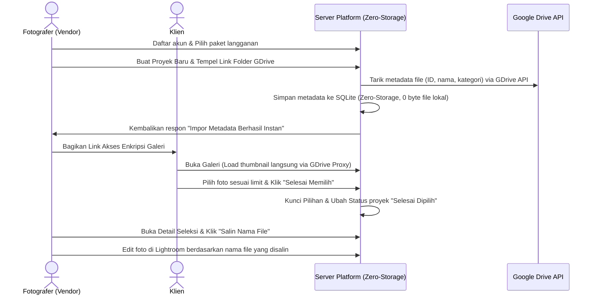

# 📘 01. Spesifikasi Sistem, Visi & Arsitektur (Pick Your Photo)

> **Dokumen Resmi Spesifikasi Platform SaaS Pick Your Photo**  
> Lokasi: `docs/01-SYSTEM-SPECIFICATION.md`

---

## 🎯 1. Visi & Misi

### Visi
Menjadi platform SaaS (Software as a Service) nomor satu bagi fotografer profesional untuk berkolaborasi dengan klien dalam memilih foto terbaik secara instan, aman, dan elegan, sekaligus meningkatkan nilai profesionalisme brand mereka di mata klien.

### Misi
1. **Menghilangkan Kerumitan Manual:** Mengeliminasi proses manual pemilihan foto melalui chat WhatsApp atau spreadsheet yang melelahkan dan memakan waktu berjam-jam.
2. **Arsitektur Zero-Storage Kilat:** Menyediakan fitur impor metadata langsung dari Google Drive tanpa menyimpan berkas fisik foto di disk server (0 byte storage overhead).
3. **Keamanan & Privasi:** Memberikan keamanan galeri klien dengan proteksi kunci akses unik (*Access Key*) sehingga privasi foto klien tetap terjaga.
4. **Skalabilitas Bisnis Fotografer:** Membantu fotografer mengelola banyak proyek foto secara rapi dengan otomatisasi masa berlaku galeri.

---

## 👥 2. Segmentasi Pengguna (Target Audiens)
1. **Wedding & Event Photographer:** Fotografer pernikahan/acara yang menghasilkan ribuan foto sekali jepret dan membutuhkan klien memilih beberapa puluh foto terbaik untuk diedit/dicetak.
2. **Studio & Portrait Photographer:** Fotografer studio/keluarga/wisuda yang membutuhkan seleksi foto cepat untuk proses cetak album.
3. **Product & Commercial Photographer:** Fotografer produk yang bekerja sama dengan brand/klien korporasi untuk memilih aset foto yang disetujui.

---

## ⚡ 3. Fitur Utama Platform (Core Features)

### 1. Sistem Keanggotaan Fotografer (SaaS Multi-Tier Subscription)
* **Paket Langganan Dinamis:** Superadmin dapat membuat paket dengan 2 tipe utama:
  * **Tipe Limit-Based:** Dibatasi oleh jumlah proyek aktif maksimal dan jumlah foto maksimal per proyek.
  * **Tipe Storage-Based:** Tanpa batasan jumlah proyek atau foto, tetapi dibatasi oleh kuota kapasitas disk (dalam MB/GB).
* **Satu Kali Uji Coba (One-Time Free Trial):** Sistem mengunci fitur Free Trial agar hanya dapat digunakan sekali saat mendaftar, mencegah eksploitasi berulang.
* **Proses Registrasi Premium & Instan:**
  * **Registrasi Berbayar:** Menampilkan tujuan rekening bank admin dan form upload bukti transfer.
  * **Registrasi Free Trial:** Secara otomatis menyembunyikan form transfer bank melalui animasi geser (*slide & fade*).
* **Integrasi WhatsApp Redirect:** Setelah mendaftar, calon vendor diarahkan ke WhatsApp Admin dengan pesan template otomatis.

### 2. Google Drive Importer (Zero-Storage Architecture)
* **Impor Link Google Drive Instan:** Fotografer cukup menempelkan link folder Google Drive publik berisi foto-foto klien.
* **Zero-Storage Metadata Fetcher:** Sistem membaca daftar file foto (ID, nama file, kategori subfolder) dari Google Drive API dalam hitungan detik tanpa mengunduh berkas fisik foto ke disk server.
* **Dynamic Thumbnail Proxy:** Foto ditampilkan secara langsung di galeri klien melalui URL Thumbnail Google Drive / Proxy tanpa membuat salinan berkas lokal, menjamin kecepatan maksimal dan hemat kuota server.

### 3. Galeri Klien Interaktif & Aman (Client Selection Portal)
* **Akses Tanpa Login:** Klien dapat membuka tautan galeri secara instan tanpa perlu mendaftar akun, cukup menggunakan kunci enkripsi unik di URL.
* **Batas Maksimal Pilihan (Max Selection Limit):** Fotografer dapat menentukan batas maksimal foto yang boleh dipilih oleh klien (misal: pilih maksimal 50 dari 200 foto).
* **Tampilan Grid & Lightbox Modern:** Antarmuka responsif di HP maupun komputer dengan background gelap (*dark mode*) mewah bergaya glassmorphism.
* **Fitur Satu Klik Salin Nama File:** Setelah klien menyelesaikan seleksi, fotografer dapat menyalin daftar nama file foto yang dipilih dalam format kompilasi teks dengan satu klik untuk langsung dimasukkan ke Adobe Lightroom / folder lokal komputer untuk proses editing lanjutan.

---

## 🔄 4. Cara Kerja Sistem (User Journey Flow)

---

## 💎 5. Nilai Jual Utama (USP)

* **Zero-Storage Architecture:** Bebas dari masalah disk server penuh karena berkas fisik foto tidak disimpan di server lokal.
* **Menghemat Waktu Hingga 90%:** Mengubah proses seleksi foto manual menjadi otomatisasi 5 menit.
* **Lightroom Ready:** Fotografer cukup menyalin nama file hasil seleksi klien dan memfilternya langsung di Adobe Lightroom untuk editing cepat.
