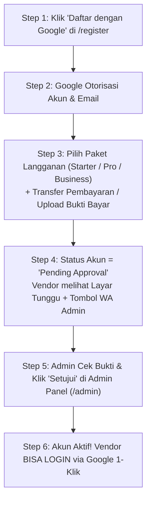

# 📋 04. Rencana Implementasi Master (Plan 5 - Spam-Proof Onboarding)

> **Dokumen Master Rencana Pengembangan & Roadmap Fitur SaaS**  
> Lokasi: `docs/04-IMPLEMENTATION-PLAN.md`

---

## 🏛️ 1. Arsitektur Alur Onboarding Vendor (Spam-Proof & High Retention)

> **Keunggulan Alur Spam-Proof**:  
> Pengunjung yang hanya iseng klik Google Sign-In **TIDAK BISA masuk ke dashboard** sebelum memilih paket berlangganan & dikonfirmasi oleh Admin. Sistem 100% aman dari spamming akun fiktif!

---

## 🎯 2. Poin-Poin Rencana Terakhir (Plan 5)

### 1. Integrasi Google Sign-In 1-Klik & Alur Pilih Paket (`/register`)
- **Step 1**: Klik **"🌐 Daftar dengan Google"** (Mengambil Nama & Email otomatis).
- **Step 2**: Pilih Paket Langganan (**Starter**, **Pro Studio**, **Business Studio**) & Unggah Bukti Bayar / Konfirmasi WhatsApp.
- **Step 3**: Akun tersimpan dengan status `pending` + Tampilan Layar Verifikasi Ramah dengan link WhatsApp Admin.
- **Step 4**: Setelah Admin klik **"Setujui Pendaftaran"** di Admin Panel, akun berubah menjadi `active` dan vendor bisa **Login 1-Klik via Google** di `/login`.

### 2. Integrasi Instant Trial Widget pada Landing Page (`public/landing.html`)
- **Tujuan**: Memungkinkan pengunjung Landing Page langsung mengetes galeri trial 1-jam instan dari Hero Section halaman depan.
- **Tindakan**: Sisipkan container widget trial atau tombol modal trial yang terhubung dengan `/api/trial/create`.

### 3. Tombol Otorisasi 1-Klik Google Master OAuth Admin (`components/admin/AdminSettings.jsx`)
- **Tujuan**: Memudahkan Pemilik SaaS (Admin) menghubungkan akun Google Studio Master cukup dengan mengeklik tombol di Admin Panel.
- **Tindakan**: Pasang tombol **"🔑 Hubungkan Akun Google Studio Master"** di `AdminSettings.jsx` yang mengarahkan Admin ke layar persetujuan Google Cloud.

### 4. Tampilan White-Label Logo Studio di Galeri Klien (`app/gallery/`)
- **Tujuan**: Menampilkan Logo Studio Vendor pada header galeri seleksi milik klien jika vendor berlangganan Paket Pro Studio / Business Studio (`allowCustomLogo === 1`).

---

## 🚀 3. Tahapan Instruksi Rilis & Verifikasi

1. **Vendor Onboarding & Google Auth Routes**:
   - `app/api/auth/google/route.js` (Auth URL Generator).
   - `app/api/auth/google/callback/route.js` (Fetch profile Google, handle `choose-plan` & status `pending`).
   - `app/(auth)/register/page.js` & `login/page.js` (Integrasi tombol Google Sign-In + Onboarding 4-Step).
2. **Admin Master OAuth Callback Route**:
   - `app/api/admin/auth/google/route.js` & `callback/route.js` untuk admin master drive connection.
3. **Landing Page Trial Widget & Custom Logo Check**:
   - Sisipkan `TrialWidget` di `public/landing.html`.
   - Update header galeri klien untuk render `vendor.logoUrl` jika `allowCustomLogo === 1`.
